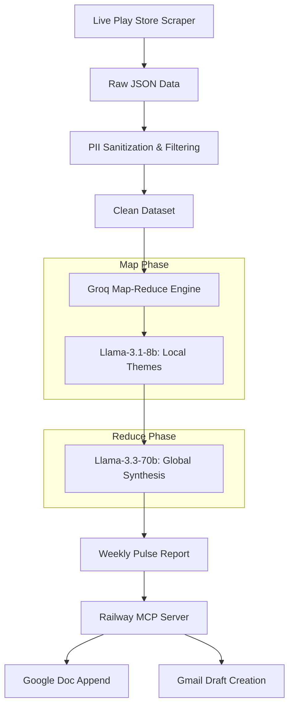

# Groww AI Agent: Weekly Pulse Orchestrator 🤖📊

An automated AI pipeline that scrapes live Android app reviews for Groww, sanitizes them for privacy, extracts key themes using a Groq Map-Reduce LLM engine, and securely delivers a sub-250-word Weekly Pulse Report to Google Docs and Gmail using a Serverless MCP architecture.

## 🌟 Overview

As a Product Manager, parsing thousands of reviews manually is impossible. This AI Agent acts as an automated assistant that runs every Monday to provide a "Weekly Pulse". 

### Key Features:
- **Live Ingestion**: Uses `google-play-scraper` to fetch thousands of real-time reviews.
- **Strict Quality Control**: Excludes non-English reviews, emoji-only spam, and extremely short reviews (under 8 words).
- **Zero-PII Sanitization**: Aggressively strips emails, phone numbers, and UUIDs via Regex before data ever touches an LLM.
- **Map-Reduce Architecture**: Uses `llama-3.1-8b-instant` for localized chunk mapping and `llama-3.3-70b-versatile` for global synthesis, expertly dodging free-tier token limits (1K TPM limit).
- **Serverless MCP Delivery**: Uses the Model Context Protocol (MCP) to seamlessly communicate with a remote Node.js Express server to append Google Docs and draft Gmails without local OAuth flows.
- **Automated Scheduling**: Fully integrated with GitHub Actions to run silently in the cloud every week.

## 🏗️ System Architecture



## 🚀 Getting Started (Local Development)

### 1. Prerequisites
- Python 3.10+
- A valid Groq API Key
- A running instance of the [Google Workspace MCP Server](https://github.com/Santhosh-A-Git/MCP-Server)

### 2. Installation
Clone the repository and install the required dependencies:
```bash
git clone https://github.com/Santhosh-A-Git/Grow-Reviews-Weekly-Pulse-Report-AI-Agent.git
cd Grow-Reviews-Weekly-Pulse-Report-AI-Agent
pip install -r requirements.txt
```

### 3. Environment Variables
Create a `.env` file in the root directory:
```env
GROQ_API_KEY="your_groq_key"
GOOGLE_DOC_ID="your_google_doc_id"
GMAIL_TO_EMAIL="stakeholder@example.com"
```

### 4. Running the Pipeline
You can trigger the entire pipeline end-to-end with a single command:
```bash
python src/main.py
```
*(Note: The LLM Engine phase contains intentional 61-second sleeps between chunks to respect Groq API rate limits. The full script takes ~12 minutes to run).*

## ☁️ GitHub Actions Automation

This repository includes a `.github/workflows/weekly_pulse.yml` file that automates the pipeline.

**To enable the cloud scheduler:**
1. Navigate to **Settings > Secrets and variables > Actions** in this GitHub repository.
2. Add `GROQ_API_KEY`, `GOOGLE_DOC_ID`, and `GMAIL_TO_EMAIL` as Repository Secrets.
3. The Action will automatically run every Monday at 9:00 AM UTC.

## 📂 Project Structure

- `src/ingestion.py`: Connects to Play Store and downloads reviews.
- `src/sanitization.py`: Applies Regex and length constraints.
- `src/llm_engine.py`: Groq Map-Reduce orchestration.
- `src/mcp_delivery.py`: Server-Sent Events (SSE) integration for Google APIs.
- `src/main.py`: The master execution script.
- `data/`: Local storage for intermediate artifacts (ignored in git).
